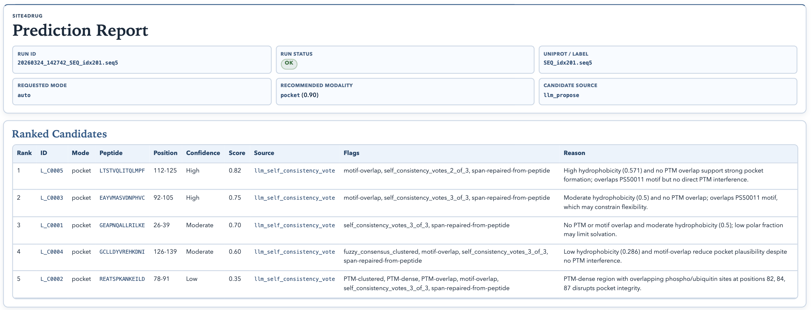
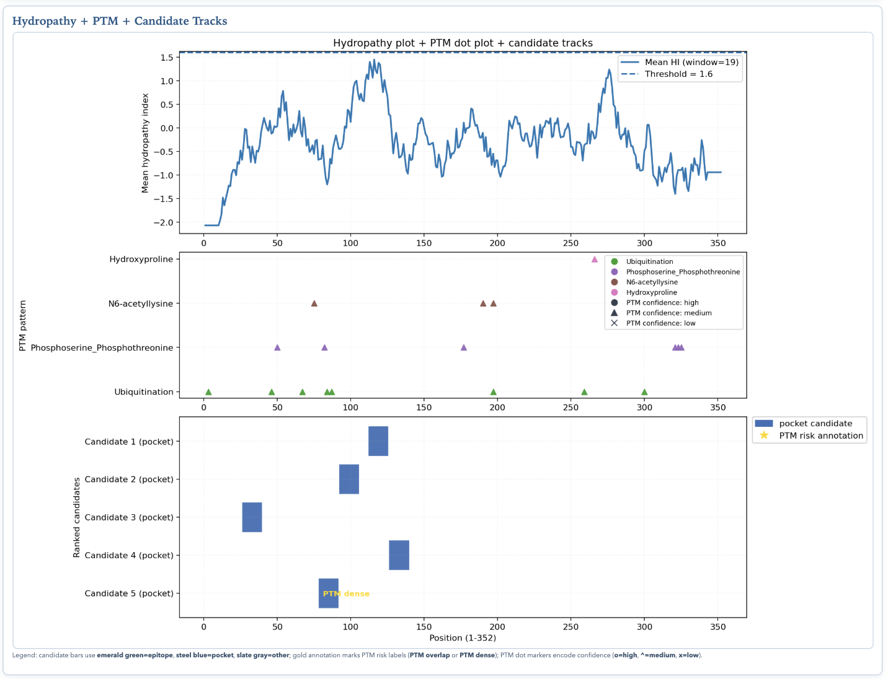

# Demo for Site4Drug: Predicting Drug-Binding Target Sites with an AI Agent

This repository provides the inference demo and paper artifact for **Site4Drug**, an AI-agent system for predicting drug-binding target sites from protein sequences. Given an amino-acid sequence, Site4Drug recommends a binding modality, proposes ranked targetable regions, annotates each candidate with sequence-derived evidence, and writes an auditable prediction report.

The demo is meant to show what a user gets from a Site4Drug run: a ranked candidate table, evidence-backed rationale, risk flags, and a hydropathy/PTM/candidate-track visualization that makes the site-selection decision easier to inspect.

## Preview





## Setup

```bash
cd <repo-root>
python3 -m venv .venv
source .venv/bin/activate
python -m pip install -e .[demo,notebooks]
./scripts/setup_tinker_key.sh
source .tinker.env
```

The setup script prompts for `TINKER_API_KEY` and stores it in `.tinker.env`.

For CLI-only use, the smaller install is enough:

```bash
python -m pip install -e .
./scripts/setup_tinker_key.sh
source .tinker.env
```

## Run Inference

Run with a raw sequence:

```bash
predict \
  --uniprot TEST_SEQ \
  --sequence ACDEFGHIKLMNPQRSTVWYACDEFGHIKLMNPQRSTVWY \
  --mode auto \
  --top-k 5
```

Run from a FASTA file:

```bash
predict \
  --uniprot P29996 \
  --sequence-file antigen.fasta \
  --mode auto \
  --top-k 5
```

You can also call the module entrypoint directly:

```bash
python -m site4drug_inference.demo.predict_site --help
```

## What a Run Creates

By default, each prediction run writes a new folder under:

```text
outputs/predictions/<timestamp>_<label>/
```

A typical run creates:

```text
prediction_log.json          # full structured run payload and provenance
prediction_report.md         # compact Markdown report
prediction_report.html       # compact HTML report
hydropathy_ptm_plot.png      # hydropathy/PTM/candidate-track plot
hydropathy_ptm_plot.json     # structured plot inputs
agent_traces.json            # specialist-agent traces
```

If `--self-consistency-k` is greater than 1, per-attempt artifacts are also written under `self_consistency/`.

At the end of a CLI run, the terminal prints the paths to the JSON log, Markdown report, and HTML report.

## Optional Gradio Demo

Launch the interactive demo:

```bash
./scripts/run_gradio_demo.sh
```

To choose a specific port:

```bash
SITE4DRUG_DEMO_PORT=7890 ./scripts/run_gradio_demo.sh
```

The Gradio demo uses the same inference pipeline as the CLI and writes the same report artifacts.

## Data

The `data/` directory contains the lightweight reference data used by the demo and paper artifact:

```text
data/Site4Drug_GroundTruth.json
```

Curated Site4Drug validation data, including target, drug/modality, reference-site, prediction, and benchmark-group metadata.

```text
data/tcell_regions_with_seq.parquet
```

IEDB-derived T-cell epitope data with associated protein sequences.

Final reporting spreadsheets are stored in:

```text
results/
```

Appendix handoff artifacts for Module 2 are stored in:

```text
Appendix: BoltzGen/
Appendix: DrugCLIP/
```

Because these appendix paths contain spaces and a colon, quote them in shell commands:

```bash
ls "Appendix: DrugCLIP/results"
```

## Useful Options

Most users can start with `--mode auto` and `--top-k 5`. Common options are:

```text
--mode {auto,epitope,pocket}       requested binding-site mode
--top-k                            number of ranked regions to return
--self-consistency-k               repeat proposal generation and aggregate candidates
--sequence-file                    read a FASTA or plain-text sequence file
--no-plot                          skip hydropathy/PTM plot generation
--output-dir                       choose where prediction folders are written
```

When `--sequence` or `--sequence-file` is provided, `--uniprot` is used as the run label. If no sequence is provided, `predict` can try to resolve the sequence from the provided UniProt accession unless `--no-online-lookup` is set.

## Repository Layout

```text
site4drug_inference/
  common/       # sequence features, PTM/motif integration, schemas, sampling helpers
  demo/         # prediction CLI, report rendering, plotting, panel logic, Gradio demo
data/           # curated validation data and IEDB-derived sequence table
docs/assets/    # README preview images
results/        # final reporting spreadsheets
notebooks/      # reproducibility notebooks
tests/          # lightweight regression and smoke tests
```
